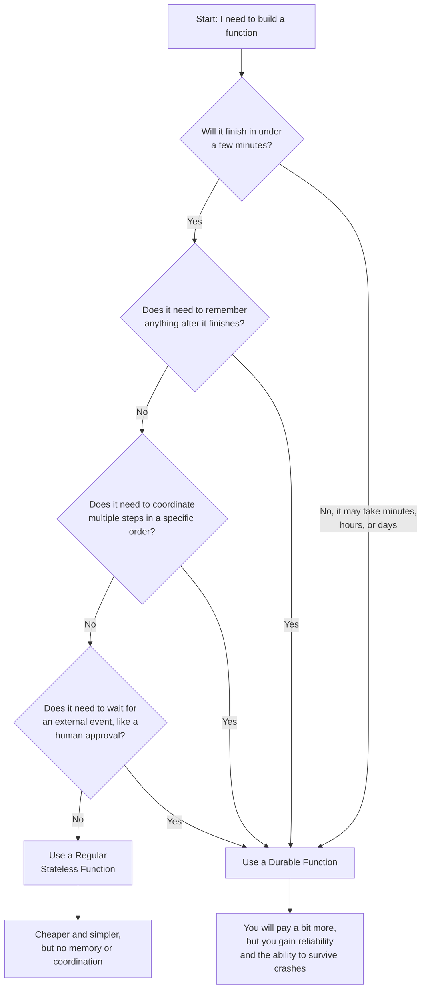
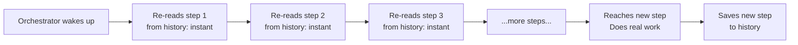

Week 2 --- Durable Functions

Function Type Architecture

Effa & Maham | Supervisor: Dr. A.Khawaja | SProj 2026-27-DCW

# Task 4: Stateful vs Stateless Decision Framework

## Overview

This document answers one simple question: **when should you use a normal Azure Function, and when should you use a Durable Function instead?**

To answer that, we first need to understand what "stateful" and "stateless" actually mean in plain words, then look at the real cost of choosing Durable Functions, so the decision isn't one-sided.

---

## Part 1: The basic difference, explained simply

### What is a "stateless" (regular) Azure Function?

Think of a stateless function like a **calculator**. You give it a number, it gives you an answer, and then it forgets everything. The next time you use it, it has no memory of what you asked before.

A regular Azure Function works the same way:
- It gets triggered (someone calls it, a file gets uploaded, a timer goes off)
- It runs its code, start to finish, in one go
- It returns a result
- It forgets everything the moment it's done

It doesn't remember anything about previous runs, and it can't pause itself and continue later. If it needs to wait for something, it has to keep running (using up time and resources) while it waits.

### What is a "stateful" (Durable) Function?

Think of a stateful function like a **notebook you keep writing in over many days**. Every time you write something, you save the notebook. Even if you close it and come back a week later, you can open it again and see exactly what you wrote: nothing is lost.

A Durable Function works the same way:
- It can run across minutes, hours, or even days
- Every step it completes gets **saved permanently** (this is called a "checkpoint")
- If the app crashes, restarts, or gets shut down completely, it can pick up exactly where it left off: because the notebook (its saved history) still has everything written down
- It can coordinate multiple steps, wait for things, and remember exactly how far it got

### Simple side-by-side comparison

| Question | Regular Function | Durable Function |
|---|---|---|
| Does it remember anything between runs? | No | Yes: everything is saved |
| Can it pause and continue later? | No | Yes |
| What happens if the app crashes mid-task? | The work is lost, you start over | It picks up exactly where it stopped |
| Can it coordinate multiple steps in order? | Not on its own | Yes, that's its main job |
| Is it simple to understand? | Very simple | More complex, more moving parts |
| Does it cost extra to run? | Cheaper | More expensive (explained in Part 3) |

---

## Part 2: The Decision Framework

Here is a simple framework you can use any time you're deciding which one to build.

### Flowchart: Which one should I use?

### The four factors, explained one at a time

#### Factor 1: Execution duration (how long does the task take?)

This is the easiest factor to check first.

- **Seconds to a couple of minutes** → a regular function is almost always the right choice. Example: resizing an image after it's uploaded, or validating a form submission.
- **Minutes, hours, or days** → a regular function isn't built for this. It would need to stay running the whole time, which is wasteful and risky (if it crashes, you lose everything). A Durable Function can "sleep" during long waits without wasting resources, and it survives restarts.

#### Factor 2: Coordination needs (does it need to manage multiple steps?)

- **One single task, done once, with nothing else depending on it** → regular function.
- **Several tasks that must happen in a specific order, or at the same time and then combined, or need retrying automatically** → Durable Function. This is called "orchestration," and it's the entire reason Durable Functions exist.

Example: sending one confirmation email → regular function.
Example: process an order → check payment → update inventory → notify shipping → send confirmation, all as one connected workflow → Durable Function.

#### Factor 3: State management (does it need to remember progress?)

- **Nothing to remember, each run is independent** → regular function.
- **Needs to know "how far did I get" even after a crash or restart** → Durable Function, because it automatically saves progress after every step.

#### Factor 4: Cost

- Regular functions are cheaper because they do the bare minimum: run, finish, done.
- Durable Functions cost more because every step gets **saved to storage**, and storage operations aren't free. The more steps your workflow has, the more it costs. (Full breakdown of this is in Part 3 below.)

### Quick reference table

| Factor | Choose Regular Function if... | Choose Durable Function if... |
|---|---|---|
| Duration | Finishes in seconds/minutes | Takes minutes, hours, or days |
| Coordination | Single independent task | Multiple steps in sequence, parallel tasks, or waiting for events |
| State | Nothing needs to be remembered | Needs to remember progress across restarts |
| Cost sensitivity | Very cost-sensitive, simple workload | Willing to pay more for reliability and coordination |

---

## Part 3: The Overhead of Durable Functions (the hidden costs)

Durable Functions aren't "free reliability": they come with real costs. This section explains each cost in plain words, based on Microsoft's own documentation.

### Why is there overhead at all?

Remember the notebook idea from Part 1: every time a Durable Function completes a step, it has to **write that step down permanently** so it's never lost. Writing things down isn't free. It takes time, and it takes storage space. This is where all three overhead costs come from.

### Overhead 1: Storage transactions

**What it means in simple words:** every single small action inside a Durable Function: starting a step, finishing a step, creating a timer, receiving a result: gets written to Azure Storage as a separate transaction. Microsoft's own documentation confirms this directly: <cite index="4-1">Azure Storage is the default storage provider for Durable Functions, and it uses queues, tables, and blobs to persist orchestration and entity state, plus blobs and blob leases to manage partitions.</cite>

Think of it like this: every time you write one sentence in your notebook, that counts as one "write," and each write has a small cost. A workflow with 3 steps might create a dozen or more of these writes once you count scheduling, completing, and checkpointing each step.

**Why it matters:** <cite index="9-1">Durable Functions generate a high volume of storage transactions, which is important enough that Microsoft recommends using a separate, dedicated storage account just for a Durable Functions app, rather than sharing one storage account across multiple things.</cite>

**Billing impact:** <cite index="3-1">when you use the Azure Functions Consumption plan, each orchestrator function replay counts as a separate billable invocation, and you also pay for the storage provider that persists your orchestration state.</cite> In other words, replays aren't just a technical detail: they directly affect your bill.

### Overhead 2: Latency from replay

**What it means in simple words:** remember from earlier tasks: every time a Durable Function's orchestrator wakes back up, it re-runs its own code from the very beginning, skipping steps it has already completed by reading them from storage. That "skipping through old steps" isn't instant: it takes a small amount of time for every single step, even though no new work is being done.

**Why it matters:** the longer your workflow runs and the more steps it has, the bigger its history becomes: and the longer each replay takes, because there's simply more to read through before reaching new work. A workflow with 5 steps replays quickly. A workflow with 500 steps has to read through much more history every time it wakes up, which adds real delay.

**Simple diagram:**

As the history grows longer (more steps), the "re-reading" part on the left takes longer and longer before any new, real work happens.

### Overhead 3: Serialization costs

**What it means in simple words:** "serialization" just means converting data (like numbers, text, or objects in your code) into a text format (usually JSON) so it can be saved to storage. Every time an orchestrator sends data to an activity, or an activity sends a result back, that data has to be converted into this saved text format, and then converted back when it's read again.

**Why it matters:** this conversion isn't free: it uses CPU time, and if the data is large, it uses more storage space too. Microsoft's documentation is direct about this: <cite index="5-1">persisting large data payloads can cause high memory usage, and the extra compression and storage steps for large messages can be expensive in terms of CPU time and I/O latency.</cite> Their recommended fix is telling too: <cite index="5-1">for large data, it's better to save the big data somewhere else (like blob storage) and only pass around a small reference to it, loading the real data only when it's actually needed.</cite> That's a strong signal that serializing big payloads directly is expensive enough to actively avoid.

### Summary table of overhead

| Overhead type | What's actually happening | Why it costs you |
|---|---|---|
| Storage transactions | Every step writes to Azure Storage (queues, tables, blobs) | More steps = more writes = more cost, and even replays count as billable invocations |
| Replay latency | Orchestrator re-reads its whole history every time it wakes up | Longer workflows take longer to "catch up" before doing new work |
| Serialization costs | All data passed between orchestrator and activities is converted to text (JSON) and back | Large data payloads = more CPU time and storage space used |

---

## Part 4: Putting it all together

Durable Functions give you real, valuable things: reliability, the ability to survive crashes, and the ability to coordinate complex multi-step work. But none of that is free: you're trading simplicity and lower cost for durability and coordination.

**The simplest way to remember this:**

> If your task is short, simple, and doesn't need to remember anything: use a regular function. It's cheaper and simpler.
>
> If your task is long, needs multiple coordinated steps, or absolutely must survive a crash without losing progress: use a Durable Function, and accept that it will cost a bit more and run a little slower because of the storage, replay, and serialization overhead explained above.

---

## Summary

- A **stateless (regular) function** is like a calculator: does one job, then forgets everything.
- A **stateful (Durable) function** is like a notebook: saves every step permanently, so nothing is ever lost, even after a crash.
- Use the **four-factor framework** (duration, coordination, state, cost) to decide which one fits your task.
- Durable Functions come with **three real overhead costs**: storage transactions (every step is a saved write), replay latency (re-reading history takes time as it grows), and serialization costs (converting data to text and back uses CPU and storage, especially for large payloads).
- The right choice depends on whether you need reliability and coordination badly enough to accept the extra cost and complexity.
